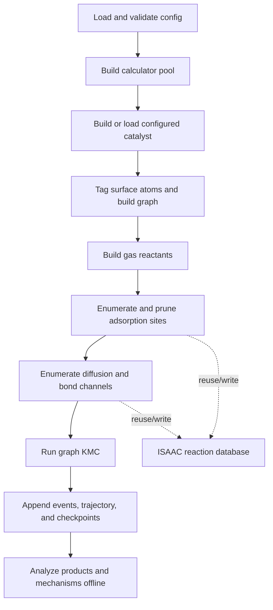

# Architecture and Scientific Workflow

## Pipeline

One configuration drives the full workflow:



`autokmc/cli/pipeline.py` coordinates the workflow. The implementation is split
across `autokmc/workflow`. First, `stages.py` prepares the calculator, structure,
graph, reactants, and adsorption sites. Next, `network.py` constructs the
optional diffusion and bond network, while `runtime.py` resolves the cache,
channel, restart, and output collaborators. Finally, `simulation.py` launches
KMC and finalizes the run. The complete sequence is:

1. Build an ASE-compatible calculator or calculator pool.
2. Construct and relax a periodic surface or nanoparticle, or load a selected
   frame from any ASE-readable catalyst file without rebuilding or relaxing
   it. The supplied production examples use built platinum structures.
3. Classify surface atoms and build the atom-connectivity graph.
4. Build gas-phase reactants from SMILES. With `relax_in_gas: false`, AutoKMC
   skips geometry relaxation but still requires a finite single-point energy.
5. Enumerate adsorption placements and optionally prune unstable classes.
6. Derive diffusion and `A + B <=> C` bond-changing channels.
7. Run rejection-free BKL/Gillespie KMC with local rate-index updates and
   on-the-fly network expansion.
8. Persist cumulative outputs and, separately, post-process the event log.

The internal KMC boundary accepts one `KMCRunRequest` and returns one
`KMCRunResult`. Configured workflows construct the typed `KMCSession` directly.
The public `autokmc.kmc.engine.run_kmc_steps` signature remains as a
compatibility adapter. Separate KMC modules handle session initialization,
local recomputation, dynamic network expansion, outputs, checkpoints, and the
canonical RNG restart state. Each result also carries run-scoped counters,
gauges, and accumulated wall-clock timings.

The KMC system retains iterable reactant inputs, including generators, before
reading their electronic energies, free energies, partial pressures, or
checkpoint data. All consumers therefore use the same gas reservoir.

## Graph state

The live NetworkX graph contains the catalyst atoms, materialized adsorbate
atoms, and site bookkeeping. Each concrete adsorbate placement stores its own
occupancy. Reverse indexes then connect occupied surface cliques to the affected
adsorption, diffusion, and bond-reaction members. After an event, the KMC engine
uses these indexes to update the local rate neighborhood in electronic-only
runs. Free-energy runs refresh all active reaction members because vibrations
include the entire occupied surface.

Each adsorption, diffusion, and bond site has a persisted `site_id`, and
`(site_id, member_index)` identifies one concrete member. These stable in-run
handles survive checkpoint copying and allow dynamic discovery to recognize a
reconstructed site without using a Python object address. When the network
expands, AutoKMC appends only new leaves to the reaction-rate index and retains
the existing reaction objects and rates. The segment tree expands only when it
runs out of capacity.

Site membership becomes immutable when a site enters the reaction index. A new
network discovery therefore adds a complete site instead of appending members
to an indexed site. Common graph metadata is accessed through
`autokmc/core/graph_state.py`, while the underlying NetworkX dictionaries remain
inspectable for notebooks and checkpoint compatibility. Site-model cache
attributes are declared for static checking and materialized only when needed.
Keeping them out of dataclass serialization preserves older checkpoints and the
established `asdict` and equality behavior.

Run-local identifiers such as `site_id`, graph node ids, adsorption
`iso_class`, and `lateral_class` are stable across restart and reconstruction
within one simulation, but are not portable scientific identifiers across
independently enumerated structures. Portable database matching therefore uses
labelled chemical topology and geometry rather than those counters.

## Reaction channels

### Adsorption and desorption

Adsorption and desorption share one lateral class. A gas reactant occupies or
vacates a concrete surface placement. Adsorption propensities are multiplied
by the configured partial pressure in bar.
Lateral graph matching labels the reacting molecule separately from occupied
neighbors, so removing different molecules cannot reuse one removal energy.

### Diffusion

Diffusion connects two placements of the same species. AutoKMC first relaxes
state A and state B. It then optimizes an ordinary NEB band to obtain the
transition-state energy. CI-NEB refines that transition only when both raw
ordinary directional barriers are at least 0.1 eV. Finally, AutoKMC derives the
forward and reverse rates from one effective transition-state level, preserving
energy consistency when it applies the minimum barrier floor.
Lateral graph matching preserves the ordered A/B endpoint roles of cached
energies; each matched member still supports both firing directions.

If the ordinary band goes 100 optimizer steps without lowering its least
energetic interior image, AutoKMC inspects the electronic-energy profile for
intermediate minima. It brackets the band's highest-energy image with the
nearest minimum on each side, optimizes the selected interior state or states
(already-optimized original endpoints are reused), and runs a fresh standard
NEB between them. The replacement band is eligible for the same check, up to
`optimization.neb_intermediate_max_refinements` times (default 10). Other
minima and path segments are not refined. The final shortened band supplies
the transition state, but diffusion rates remain referenced to the original A
and B endpoint energies.

The distance guard also triggers this check immediately after restoring the
lowest-force geometrically valid band, including during CI-NEB. The restored
profile, not the rejected geometry, supplies the minima. If none bracket the
highest peak, normal reduced-step rollback continues. Once the configured
refinement limit is reached, subsequent rollbacks only restore and restart the
current replacement band.

For a lateral environment containing neighboring adsorbates, the reaction
evaluator first obtains an optimized band for the corresponding no-neighbor
class. It calculates that bare class on demand when necessary. Next, it projects
the bare-band curvature onto the lateral endpoints and performs the full NEB
optimization. If the bare calculation fails or the projection is incompatible,
the channel uses its configured interpolation.

### Bond changes

Bond templates represent reversible `A + B <=> C` chemistry. AutoKMC can build
unlisted leaf species implied by the templates at zero gas pressure and can
expand the network when a new surface species first appears. Calculator-based
stability pruning runs before the one-representative-per-adsorption-triple
prune, so a geometrically compact but unstable member cannot displace a stable
candidate prematurely.

Each feed reactant records the atom inventory selected by its
`add_hydrogens` setting separately from its SMILES label. Initial template
generation and later network expansion use that inventory for both coupling
and dissociation. For example, `C=O` with implicit hydrogens added represents
CH₂O, so coupling it with H retains all three product hydrogens. Feed labels
and their pressure settings remain associated with the original species.

Bond NEBs use the same single highest-peak segment refinement. Its final
transition state is still reported as the barrier for the original reversible
`A + B <=> C` event, with electronic and free energetics referenced to the
original A+B and C states rather than the selected intermediate minima.

## Rates and free energy

Rates use an Eyring prefactor:

```text
k = transmission_coefficient * (k_B T / h) * exp(-barrier / (k_B T))
```

Temperature must be finite and positive; the transmission coefficient must be
finite and non-negative. Nonfinite endpoint energies, free energies, barriers,
or rates are errors and are never admitted into KMC.

When `free_energy.enabled` is true:

- gas species use ideal-gas thermochemistry,
- surface endpoints and transition states use a coupled Hessian over every
  adsorbate atom in the simulated cell; catalyst atoms are not displaced,
- adsorption empty endpoints retain the harmonic correction of surviving
  adsorbates, and gas-product bond endpoints add that remaining-surface
  correction to the gas molecule's ideal-gas correction,
- calculation structures and lateral class identities include all occupied
  adsorbates, regardless of the local lateral-interaction controls,
- raw vibrational spectra must have no significant imaginary modes at minima;
  bond transition states require one, and diffusion transition states permit
  zero or one under the endpoint-like diffusion policy. The separate
  `imaginary_mode_tolerance_ev` controls this check before low-frequency
  thermochemistry filtering; transition-state checks require
  `include_ts_vibrations`,
- diffusion and bond endpoints and transition states use their populated free
  energies when available,
- vibration caches are separated by species, reaction class, iso-class, and
  lateral class, then content-addressed by geometry, displacement settings, and
  calculator identity,
- independent finite-difference displacements and whole NEB calculations share
  the configured calculator pool without sharing live calculator objects; each
  NEB holds one calculator for its complete lifecycle,
- broad initialization sweeps parallelize independent sites, while isolated
  transition-state work evaluates one band per calculator and thermochemistry
  may parallelize independent displacements; the two levels are never nested.

When free-energy fields are absent, the corresponding channel uses electronic
energies. See [Configuration](configuration.md#free_energy) for the controls.

## Failure behavior

Scientific and persistence failures are explicit:

- failed gas, structure, or endpoint stability invalidates only the affected
  reaction class when that invalidity is an expected chemical result; numerical
  NEB non-convergence preserves the band, omits that candidate from the current
  rate-index sweep, and leaves it undecided for a later retry without stopping
  other valid KMC events,
- on-the-fly species/site/network expansion retries transient runtime failures
  three times, records each stage under the checkpointed
  `bond_registry.expansion_failures` diagnostics, and raises after exhaustion;
  only invalid molecular definitions are permanently excluded,
- unexpected calculator and thermochemistry exceptions propagate,
- requested event, trajectory, summary, and checkpoint writes must succeed,
- JSON output rejects nonfinite numeric values,
- an inconsistent event history is rejected by strict offline analysis,
- checkpoint resume rejects scientific-configuration drift and reconciles the
  event log to the checkpoint's committed count and byte offset before any
  summary is reconstructed,
- reaction folders carry an immutable discovery step, and resume moves
  post-checkpoint discoveries outside the authoritative hierarchy,
- trajectory resume validates a strictly increasing committed `kmc_step`
  prefix and atomically removes frames beyond the checkpoint step before
  append.

File-backed catalysts are parsed during read-only preflight before calculator
probing. Their resolved source path, selected frame, optional explicit format,
and frozen-atom selection are retained with the resolved configuration and
catalyst provenance, so an input-selection mistake is visible before expensive
chemistry begins. A calculator serialized with the selected frame is detached
in favor of the configured calculator. Cell and periodic-boundary metadata are
therefore input responsibilities and must be suitable for surface
classification.

Together, these rules prevent a run from silently continuing with `NaN`
energetics, incomplete provenance, or a checkpoint that was never written.
