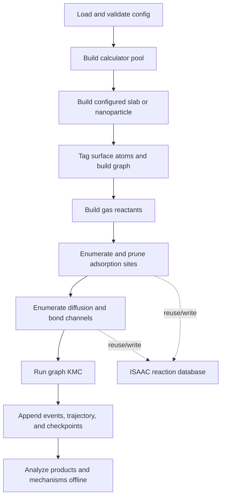

# Architecture and Scientific Workflow

## Pipeline

One configuration drives the full workflow:



The CLI implementation is in `autokmc/cli/pipeline.py`. The main stages are:

1. Build an ASE-compatible calculator or calculator pool.
2. Construct and relax a periodic surface or nanoparticle. The supplied
   production examples use platinum.
3. classify surface atoms and build the atom-connectivity graph.
4. Build gas-phase reactants from SMILES. With `relax_in_gas: false`, AutoKMC
   skips geometry relaxation but still requires a finite single-point energy.
5. Enumerate adsorption placements and optionally prune unstable classes.
6. Derive diffusion and `A + B <=> C` bond-changing channels.
7. Run rejection-free BKL/Gillespie KMC with local rate-index updates and
   on-the-fly network expansion.
8. Persist cumulative outputs and, separately, post-process the event log.

## Graph state

The live NetworkX graph contains catalyst atoms, materialized adsorbate atoms,
and site bookkeeping. Occupancy is attached to concrete adsorbate placements.
Reverse indexes connect occupied surface cliques to affected adsorption,
diffusion, and bond-reaction members so the KMC engine can update only the
local rate neighborhood after an event.

Run-local identifiers such as graph node ids, adsorption `iso_class`, and
`lateral_class` are useful inside one simulation but are not stable scientific
identifiers across independent runs. Portable database matching therefore
uses labelled chemical topology rather than those counters.

## Reaction channels

### Adsorption and desorption

Adsorption and desorption share one lateral class. A gas reactant occupies or
vacates a concrete surface placement. Adsorption propensities are multiplied
by the configured partial pressure in bar.

### Diffusion

Diffusion connects two placements of the same species. Endpoint relaxation and
CI-NEB populate state A, state B, and transition-state energies. Both forward
and reverse barriers are derived from one effective transition-state level so
detailed energy consistency is preserved when the minimum barrier floor is
applied.

### Bond changes

Bond templates represent reversible `A + B <=> C` chemistry. AutoKMC can build
unlisted leaf species implied by the templates at zero gas pressure and can
expand the network when a new surface species first appears. Calculator-based
stability pruning runs before the one-representative-per-adsorption-triple
prune, so a geometrically compact but unstable member cannot displace a stable
candidate prematurely.

## Rates and free energy

Rates use an Eyring prefactor:

```text
k = transmission_coefficient * (k_B T / h) * exp(-barrier / (k_B T))
```

Temperature must be finite and positive; the transmission coefficient must be
finite and non-negative. Nonfinite endpoint energies, free energies, barriers,
or rates are errors and are never admitted into KMC.

When `free_energy.enabled` is true:

- gas species use ideal-gas thermochemistry,
- adsorbed endpoints use harmonic thermochemistry over reactive atoms,
- diffusion and bond endpoints and transition states use their populated free
  energies when available,
- vibration caches are separated by species, reaction class, iso-class, and
  lateral class.

When free-energy fields are absent, the corresponding channel uses electronic
energies. See [Configuration](configuration.md#free_energy) for the controls.

## Failure behavior

Scientific and persistence failures are explicit:

- failed gas, structure, endpoint, or NEB convergence raises or invalidates
  only a reaction class when that invalidity is an expected stability result,
- unexpected calculator and thermochemistry exceptions propagate,
- requested event, trajectory, summary, and checkpoint writes must succeed,
- JSON output rejects nonfinite numeric values,
- an inconsistent event history is rejected by strict offline analysis.

This prevents a run from silently continuing with `NaN` energetics, incomplete
provenance, or a checkpoint that was never written.
