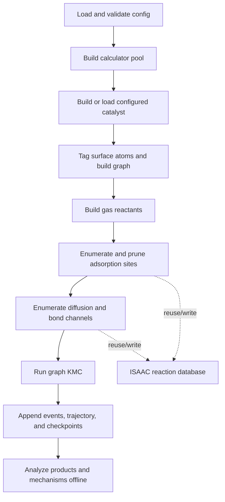

# Architecture and Scientific Workflow

## Pipeline

One configuration drives the full workflow:



`autokmc/cli/pipeline.py` is a thin coordinator.  The configured workflow is
implemented by `autokmc/workflow`: `stages.py` prepares the calculator,
structure, graph, reactants, and adsorption sites; `network.py` constructs the
optional diffusion/bond network; `runtime.py` resolves cache, channel, restart,
and output collaborators; and `simulation.py` owns KMC launch and finalization.
The main stages are:

1. Build an ASE-compatible calculator or calculator pool.
2. Construct and relax a periodic surface or nanoparticle, or load a selected
   frame from any ASE-readable catalyst file without rebuilding or relaxing
   it. The supplied production examples use built platinum structures.
3. classify surface atoms and build the atom-connectivity graph.
4. Build gas-phase reactants from SMILES. With `relax_in_gas: false`, AutoKMC
   skips geometry relaxation but still requires a finite single-point energy.
5. Enumerate adsorption placements and optionally prune unstable classes.
6. Derive diffusion and `A + B <=> C` bond-changing channels.
7. Run rejection-free BKL/Gillespie KMC with local rate-index updates and
   on-the-fly network expansion.
8. Persist cumulative outputs and, separately, post-process the event log.

The internal KMC boundary is one `KMCRunRequest` producing one `KMCRunResult`;
configured workflows construct the typed `KMCSession` directly.  The public
`autokmc.kmc.engine.run_kmc_steps` signature remains solely as a compatibility
adapter.  Session initialization, local recomputation, dynamic network
expansion, output/checkpoint handling, and canonical RNG restart state live in
separate KMC modules.  Each result also carries run-scoped counters, gauges,
and accumulated wall-clock timings.

## Graph state

The live NetworkX graph contains catalyst atoms, materialized adsorbate atoms,
and site bookkeeping. Occupancy is attached to concrete adsorbate placements.
Reverse indexes connect occupied surface cliques to affected adsorption,
diffusion, and bond-reaction members so the KMC engine can update only the
local rate neighborhood after an event.
Each adsorption, diffusion, and bond site has a persisted `site_id`; a concrete
member is addressed by `(site_id, member_index)`.  These stable in-run handles
survive checkpoint copying and let dynamic discovery recognise a reconstructed
site without relying on a Python object address.  Dynamic expansion appends
only new leaves to the reaction-rate index, retaining all existing reaction
objects and rates; the segment tree expands geometrically only when its current
capacity is exhausted.
Site membership is immutable once a site enters the reaction index.  New
network discoveries therefore add complete sites rather than appending members
to an indexed site; a future member-growth feature must replace the site
atomically or extend the index and invalidate its stable identity together.
Common graph metadata is accessed through `autokmc/core/graph_state.py`; the
underlying NetworkX dictionaries remain inspectable for notebooks and
checkpoint compatibility.
Site-model cache attributes are declared for static checking but remain lazily
materialized at runtime.  Keeping them out of dataclass serialization preserves
older checkpoints and the established `asdict`/equality surface.

Run-local identifiers such as `site_id`, graph node ids, adsorption
`iso_class`, and `lateral_class` are stable across restart and reconstruction
within one simulation, but are not portable scientific identifiers across
independently enumerated structures. Portable database matching therefore uses
labelled chemical topology and geometry rather than those counters.

## Reaction channels

### Adsorption and desorption

Adsorption and desorption share one lateral class. A gas reactant occupies or
vacates a concrete surface placement. Adsorption propensities are multiplied
by the configured partial pressure in bar.

### Diffusion

Diffusion connects two placements of the same species. Endpoint relaxation and
ordinary NEB populate state A, state B, and transition-state energies. CI-NEB
refines the transition only when both raw ordinary directional barriers are at
least 0.1 eV. Both forward and reverse rates are derived from one effective
transition-state level so detailed energy consistency is preserved when the
minimum barrier floor is applied.

For a lateral environment containing neighbouring adsorbates, the reaction
evaluator first ensures that the corresponding no-neighbour lateral class has
an optimized NEB band. It calculates that bare class on demand, projects the
bare band curvature onto the lateral endpoints, and then performs the normal
full NEB optimization. Bare failures and projection incompatibilities degrade
to the channel's configured interpolation.

### Bond changes

Bond templates represent reversible `A + B <=> C` chemistry. AutoKMC can build
unlisted leaf species implied by the templates at zero gas pressure and can
expand the network when a new surface species first appears. Calculator-based
stability pruning runs before the one-representative-per-adsorption-triple
prune, so a geometrically compact but unstable member cannot displace a stable
candidate prematurely.

## Rates and free energy

Rates use an Eyring prefactor:

```text
k = transmission_coefficient * (k_B T / h) * exp(-barrier / (k_B T))
```

Temperature must be finite and positive; the transmission coefficient must be
finite and non-negative. Nonfinite endpoint energies, free energies, barriers,
or rates are errors and are never admitted into KMC.

When `free_energy.enabled` is true:

- gas species use ideal-gas thermochemistry,
- adsorbed endpoints use harmonic thermochemistry over reactive atoms,
- diffusion and bond endpoints and transition states use their populated free
  energies when available,
- vibration caches are separated by species, reaction class, iso-class, and
  lateral class, then content-addressed by geometry, displacement settings, and
  calculator identity,
- independent finite-difference displacements and whole NEB calculations share
  the configured calculator pool without sharing live calculator objects; each
  NEB holds one calculator for its complete lifecycle,
- broad initialization sweeps parallelize independent sites, while isolated
  transition-state work evaluates one band per calculator and thermochemistry
  may parallelize independent displacements; the two levels are never nested.

When free-energy fields are absent, the corresponding channel uses electronic
energies. See [Configuration](configuration.md#free_energy) for the controls.

## Failure behavior

Scientific and persistence failures are explicit:

- failed gas, structure, or endpoint stability invalidates only the affected
  reaction class when that invalidity is an expected chemical result; numerical
  NEB non-convergence preserves the band, omits that candidate from the current
  rate-index sweep, and leaves it undecided for a later retry without stopping
  other valid KMC events,
- on-the-fly species/site/network expansion retries transient runtime failures
  three times, records each stage under the checkpointed
  `bond_registry.expansion_failures` diagnostics, and raises after exhaustion;
  only invalid molecular definitions are permanently excluded,
- unexpected calculator and thermochemistry exceptions propagate,
- requested event, trajectory, summary, and checkpoint writes must succeed,
- JSON output rejects nonfinite numeric values,
- an inconsistent event history is rejected by strict offline analysis,
- checkpoint resume rejects scientific-configuration drift and reconciles the
  event log to the checkpoint's committed count and byte offset before any
  summary is reconstructed,
- reaction folders carry an immutable discovery step, and resume moves
  post-checkpoint discoveries outside the authoritative hierarchy,
- trajectory resume validates a strictly increasing committed `kmc_step`
  prefix and atomically removes frames beyond the checkpoint step before
  append.

File-backed catalysts are parsed during read-only preflight before calculator
probing. Their resolved source path, selected frame, optional explicit format,
and frozen-atom selection are retained with the resolved configuration and
catalyst provenance, so an input-selection mistake is visible before expensive
chemistry begins. A calculator serialized with the selected frame is detached
in favor of the configured calculator. Cell and periodic-boundary metadata are
therefore input responsibilities and must be suitable for surface
classification.

This prevents a run from silently continuing with `NaN` energetics, incomplete
provenance, or a checkpoint that was never written.
